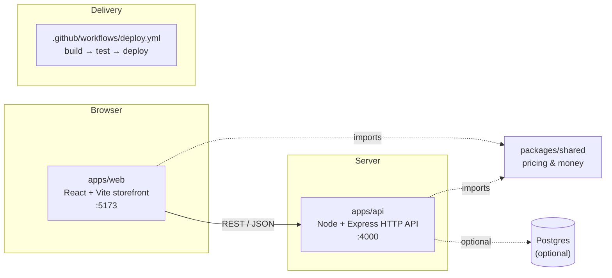

# Shopfront — Architecture

**Status:** Living document
**Last updated:** 2026-06-29
**Related:** [`DEVELOPMENT-PLAN.md`](./DEVELOPMENT-PLAN.md)

> High-level architecture for Shopfront — the e-commerce storefront for a small online retailer:
> a product catalog, cart, and checkout. This document is the shared map of *how the system is put
> together and why*; it's kept current as the codebase evolves.

---

## 1. Overview

Shopfront is a **TypeScript pnpm monorepo** with two deployable apps and one shared domain library:

- **`apps/web`** — the customer-facing storefront (React + Vite): browse the catalog, view a product,
  build a cart, and check out.
- **`apps/api`** — the backend HTTP API (Node + Express): serves the catalog and computes cart and
  checkout totals.
- **`packages/shared`** — the pricing & money domain shared by both apps, so monetary logic has a
  single source of truth.

Docker Compose brings the stack up together, and a GitHub Actions workflow builds, tests, and deploys
it.

## 2. Design principles

1. **One shared money domain.** All pricing and monetary arithmetic lives in `packages/shared` and is
   used by both the web app and the API — never duplicated. A discount or tax rule changes in exactly
   one place.
2. **Money is integer cents.** Monetary values are represented as integer cents and never as floating
   point; rounding happens only at final display. This avoids accumulated floating-point error in
   totals.
3. **Small, focused modules.** Files are kept small and single-purpose with clear names, so the
   codebase stays easy to read and change.
4. **TypeScript end to end.** One language across web, API, and shared library keeps types flowing
   through the stack.
5. **Configuration through the environment.** Ports, the database URL, the tax rate, and the
   free-shipping threshold come from environment-driven config in one place, so behavior is tunable
   per environment without code changes.

## 3. System architecture



### Repository layout

```
shopfront/
├── pnpm-workspace.yaml          # workspaces: apps/*, packages/*
├── package.json                 # root scripts (build / dev / lint / test)
├── tsconfig.base.json           # shared TS config; per-package tsconfig extends it
├── docker-compose.yml           # web + api (+ optional postgres)
├── .github/
│   └── workflows/
│       └── deploy.yml           # build → test → deploy
├── packages/
│   └── shared/                  # pricing & money domain — used by web AND api
│       ├── package.json         # name: @shopfront/shared
│       └── src/
│           ├── money.ts         # integer-cents money helpers
│           ├── pricing/
│           │   └── applyDiscount.ts   # discount math (used by the cart)
│           └── index.ts
├── apps/
│   ├── web/                     # React/Vite storefront  (+ Dockerfile)
│   │   ├── src/
│   │   │   ├── pages/           # catalog, product, cart/checkout
│   │   │   ├── components/      # product card, cart line, totals panel, discount badge
│   │   │   └── api/             # thin client for apps/api
│   │   └── Dockerfile
│   └── api/                     # Node/Express HTTP API   (+ Dockerfile)
│       ├── src/
│       │   ├── config.ts        # env-driven config (ports, DB URL, tax rate, thresholds)
│       │   ├── routes/          # products, cart, checkout
│       │   ├── checkout/
│       │   │   └── freeShipping.ts    # free-shipping threshold logic
│       │   ├── pricing/
│       │   │   └── orderTotal.ts      # order total + tax assembly
│       │   └── data/            # seed catalog
│       └── Dockerfile
└── README.md
```

## 4. Workspaces & responsibilities

### 4.1 `packages/shared` — pricing & money (`@shopfront/shared`)

The domain core. Both the web app and the API depend on it, so monetary logic stays consistent across
the stack.

- `money.ts` — the integer-cents money model and helpers (parse, format, add, multiply by quantity,
  apply a tax rate). The single source of truth for monetary arithmetic.
- `pricing/applyDiscount.ts` — applies a percentage discount to a price; used by the cart's totals.
- `index.ts` — the minimal public surface.

Built with `tsc`; consumed via `workspace:*`. Kept dependency-free.

### 4.2 `apps/api` — Node/Express HTTP API

A small, conventional REST API over the catalog and checkout flow — readable route handlers that
delegate to the shared domain.

- `config.ts` — reads the environment (`PORT`, `DATABASE_URL`, free-shipping threshold, tax rate).
- `routes/products.ts` — list / get catalog items.
- `routes/cart.ts` — compute a cart's line items and totals (delegates to `@shopfront/shared`).
- `routes/checkout.ts` — order total, tax, shipping.
- `checkout/freeShipping.ts` — decides whether an order qualifies for free shipping.
- `pricing/orderTotal.ts` — assembles the grand total (line items + tax + shipping).
- `data/catalog.ts` — the seeded product catalog.

Runs with `tsx` in dev, compiled for the container image.

### 4.3 `apps/web` — React + Vite storefront

The customer-facing store. The cart/checkout page renders a line item with a **discount badge** and a
**totals panel** (subtotal, discount, tax, shipping, grand total).

- `pages/Catalog.tsx`, `pages/Product.tsx`, `pages/Cart.tsx`.
- `components/` — product card, cart line, totals panel, discount badge.
- `api/client.ts` — a thin fetch wrapper for `apps/api`.
- Lightweight styling (CSS modules / a small stylesheet); no heavy UI library.

Dev server on **:5173**.

## 5. Domain model

| Entity | Shape (illustrative) | Notes |
|---|---|---|
| **Product** | `{ id, name, priceCents, taxRateBps }` | Prices in integer cents; tax rate in basis points. |
| **CartLine** | `{ product, quantity }` | |
| **Discount** | `{ kind: 'percent', value }` | A percentage promotion applied at the cart. |
| **OrderTotals** | `{ subtotalCents, discountCents, taxCents, shippingCents, grandTotalCents }` | What the totals panel renders. |

The money convention (integer cents, round once at display) is the standard the whole codebase
follows.

## 6. Cross-cutting concerns

- **Pricing & money** — centralized in `@shopfront/shared`; web and API both call it.
- **Configuration** — `apps/api/src/config.ts` is the single env-driven config surface (ports, DB URL,
  thresholds, tax rate).
- **Build & CI/CD** — `.github/workflows/deploy.yml` runs build → test → deploy on the configured
  branch.
- **Containerization** — `apps/*/Dockerfile` + `docker-compose.yml` bring the whole stack up together.

## 7. Tech stack

| Layer | Choice | Version | Rationale |
|---|---|---|---|
| Language | TypeScript | 5.x | One language across all tiers. |
| Package manager | pnpm (workspaces) | 9.x | Clean monorepo graph. |
| Runtime | Node.js | 20 LTS | |
| Web | React + Vite | React 18 / Vite 5 | Fast dev server on :5173. |
| API | Express | 4.x | Minimal, readable REST server. |
| Shared lib | plain TS (tsc build) | — | Zero-dependency domain package, consumed via `workspace:*`. |
| Data | seed data (default); Postgres optional | pg 16 (if used) | See [open decisions](#10-open-decisions). |
| Containers | Docker + Compose | — | Whole stack up together. |
| CI/CD | GitHub Actions | — | `deploy.yml`. |
| Tooling | ESLint + Prettier | — | Consistent style. |

## 8. Runtime topology & how it runs

- **Local dev:** `pnpm install` → `pnpm dev` runs the API (:4000) and the web dev server (:5173)
  concurrently; the web app calls the API. The shared package is built (or watched) first.
- **Compose:** `docker compose up` builds the web and API images and brings the stack up together
  (plus Postgres if the data tier is enabled).
- **CI:** a push triggers `deploy.yml` → install → build → test → deploy.

## 9. Related services

A separate **`internal-billing`** service (internal finance/invoicing) lives in its own repository. It
maintains its own copy of the finance-side money and discount logic and is not part of this monorepo.

## 10. Open decisions

| # | Decision | Options | Recommendation |
|---|---|---|---|
| D1 | **Data tier** | (a) seed data in-memory; (b) a real Postgres service + `pg`. | **Start (a)** — simpler and dependency-free; add (b) when persistence is genuinely needed. |
| D2 | **API framework** | Express vs. Fastify vs. raw `http`. | **Express** — smallest reading overhead. |
| D3 | **In-repo docs depth** | README only vs. README + this architecture note. | Keep both; this note stays high-level. |

## 11. Non-goals (for now)

- Real authentication, payments, and inventory management.
- Production hardening, scalability, and accessibility completeness.
- Persistence beyond the catalog and checkout flow.
