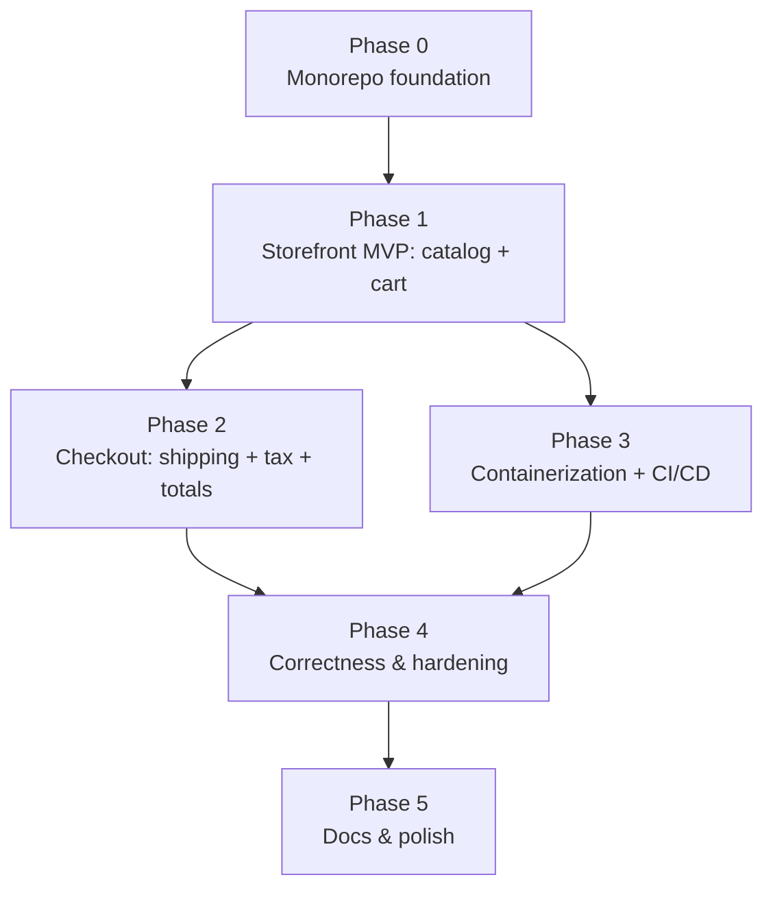

# Shopfront — Development Plan

**Status:** Living document
**Last updated:** 2026-06-30
**Related:** [`ARCHITECTURE.md`](./ARCHITECTURE.md)

> The phased roadmap for building Shopfront. We build the thinnest useful slice first — a shopper can
> browse and see a cart total — then widen outward to checkout, delivery, and hardening. Each phase has
> a clear objective and an exit gate before the next begins.

---

## Approach

Ship a working vertical slice early, then layer features on. Phases are sequenced so the app is
runnable (in a reduced form) as soon as Phase 1, and each phase leaves the build green
(`install → build → lint → test`) before the next starts.

---

## Phase 0 — Monorepo foundation

**Objective:** a clean, installable, buildable pnpm monorepo with all three workspaces wired together.

**Deliverables**
- `pnpm-workspace.yaml`, root `package.json` (scripts: `dev`, `build`, `lint`, `test`), `tsconfig.base.json`.
- Wired workspaces: `apps/web` (Vite + React), `apps/api` (Express + TS), `packages/shared` (`@shopfront/shared`).
- ESLint + Prettier; a placeholder test in each package; `.gitignore`.

**Exit gate:** `pnpm install && pnpm build && pnpm lint && pnpm test` pass from a clean clone;
`pnpm dev` brings web (:5173) and API (:4000) up and they communicate.

---

## Phase 1 — Storefront MVP: catalog + cart

**Objective:** a shopper can browse the catalog, open a product, add items to a cart, and see a
priced cart — including percentage discounts.

**Deliverables**
- `packages/shared`: `money.ts` (integer-cents helpers) + `pricing/applyDiscount.ts`.
- `apps/api`: `routes/products.ts`, `routes/cart.ts`, seeded `data/catalog.ts`.
- `apps/web`: `Catalog`, `Product`, `Cart` pages; totals panel and discount-badge components.

**Exit gate:** the catalog renders from the API; adding items updates the cart; the totals panel shows
subtotal and discount correctly for a percentage promotion.

---

## Phase 2 — Checkout: shipping + tax + totals

**Objective:** turn the cart into a complete order total with shipping and tax.

**Deliverables**
- `apps/api/checkout/freeShipping.ts` — the free-shipping threshold rule.
- `apps/api/pricing/orderTotal.ts` — assembles the grand total (line items + tax + shipping).
- `apps/web`: the checkout totals panel shows subtotal, discount, tax, shipping, and grand total.

**Exit gate:** an order's grand total is correct end to end — discount, tax, and the free-shipping
threshold all reflected in the totals panel.

---

## Phase 3 — Containerization + CI/CD

**Objective:** the stack runs as containers and ships through a pipeline.

**Deliverables**
- `apps/web/Dockerfile`, `apps/api/Dockerfile`, `docker-compose.yml` (web + api; Postgres if enabled).
- `.github/workflows/deploy.yml` — build → test → deploy, on the configured branch.

**Exit gate:** `docker compose up` brings the stack up; the workflow is valid and runs on push.

---

## Phase 4 — Correctness & hardening

**Objective:** make the money math trustworthy and the app resilient.

**Deliverables**
- Unit tests across `@shopfront/shared` (discount, tax, rounding) and the checkout assembly.
- Confirm the integer-cents convention holds end to end (no floating-point drift in totals).
- Basic error handling and input validation on the API routes.

**Exit gate:** totals are correct across a table of representative quantity/price/tax combinations;
tests cover the money and checkout paths.

---

## Phase 5 — Docs & polish

**Objective:** make the repo easy to pick up and run.

**Deliverables**
- A `README` (setup, run, project layout) and this plan kept current.
- Documented environment configuration and a reset/seed path for local data.
- A light styling pass so the storefront reads as a real store.

**Exit gate:** a newcomer can clone, install, run the stack, and shop end to end from the README alone.

---

## Status tracker

| Phase | State | Notes |
|---|---|---|
| 0 — Foundation | ✅ Done | Monorepo builds, lints, and tests green; `pnpm dev` runs web (:5173) + API (:4000) and they communicate. |
| 1 — Storefront MVP | ✅ Done | Catalog served from the API; interactive cart; totals panel with subtotal/discount/total; builds/lints/tests/typecheck green. |
| 2 — Checkout | ✅ Done | `POST /api/checkout` assembles subtotal/discount/tax/shipping/grand total (pure rules in `@shopfront/shared`); web fetches and renders them. Free-shipping threshold $50, flat fee $5.99 (env-tunable). |
| 3 — Containerize + CI | ✅ Done | `docker compose up --build` runs `web` (nginx) + `api` (Node); the web container serves the static build and reverse-proxies `/api` to the API, so it's same-origin and CORS-free. `.github/workflows/deploy.yml` runs install → lint → typecheck → test → build, then builds both images (no push — no registry configured yet). Compose also provisions a `postgres:alpine` `db` service (named volume, `DATABASE_URL` pre-wired) for seamless dev — not yet consumed; the api still serves seed data (open-decision D1). |
| 4 — Correctness & hardening | ⬜ Not started | |
| 5 — Docs & polish | ⬜ Not started | |
